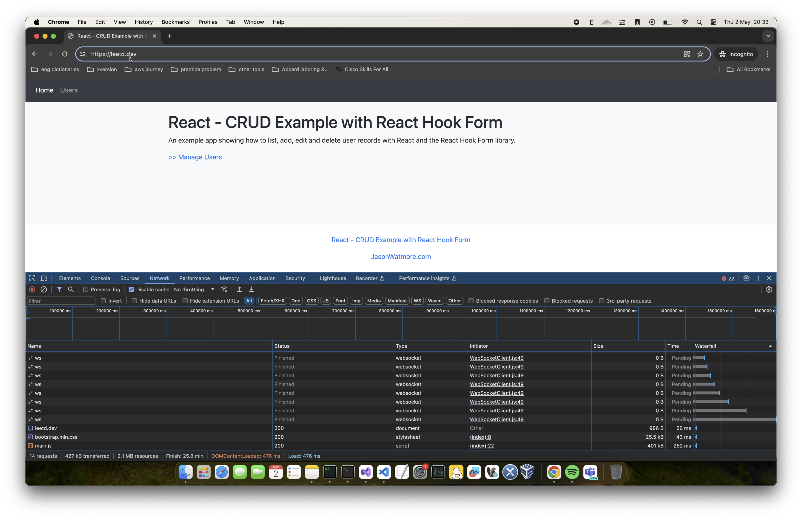
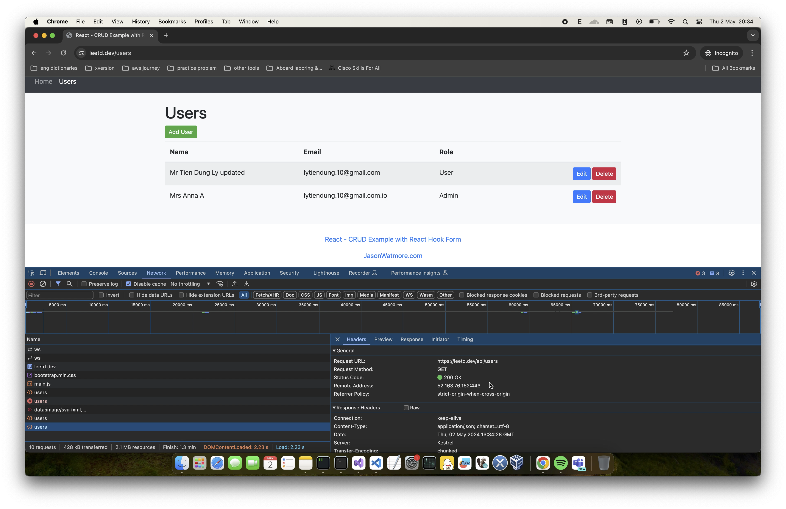

# Kubernetes: Big Lab

#### Kubernetes Lab walkthrough video
<a href="https://www.youtube.com/watch?v=d51YVGhTFWg" target="_blank"></a>

Deploy application on Kubernetes with the following requirements: 
- [x] Deploy 3 pods to run Front-End services (e.g. ReactJS, VueJS, Angular, etc.).
- [x] Deploy 3 pods to run Back-End services (e.g. C#, Java, Golang, Python, etc.).
- [x] The images for Front-End and Back-End must be built from Dockerfile and pushed to Dockerhub (default images from the Docker registry should not be used)
    - Front-end image [leetd/holiday-web]
    - Back-end image [leetd/holiday-api]
- [x] The pods should be auto-scaled based on CPU usage.
- [x] Deploy a database (e.g. MySQL, MongoDB, etc.) with the option to implement a High Availability (HA) model using Helm or StatefulSet (bonus points will be awarded).
    - Helm [zalando/postgres-operator]
- [x] Configure the Front-End services to call the Back-End services, and the Back-End services to call the database.
- [x] Store relevant credential settings in Secrets.
- [ ] (Optional) Use DaemonSet to deploy ElasticSearch (using the fluentd-elasticsearch image) or complete EFK stack or any kind of logging and monitoring stacks.
- [x] Deploy an Ingress to allow access to the Front-End service from the internet using a DNS. Configuring HTTPS is a bonus point. If a domain name is not available, use LoadBalancer service type (maximum points will not be awarded).
    - AKS
    - AGW x Ingress controller add-on: [AGW x Ingress controller]
    - Domain managed by [squarespace.com]

### AKS

- Create a new resource group
```bash
export PROJECT_NAME=buffalo
export LOCATION=southeastasia

az group create --name "$PROJECT_NAME"ResourceGroup --location $LOCATION
# {
#   "id": "/subscriptions/c3fdfb88-d756-4f25-8eba-17f28786dbda/resourceGroups/buffaloResourceGroup",
#   "location": "southeastasia",
#   "managedBy": null,
#   "name": "buffaloResourceGroup",
#   "properties": {
#     "provisioningState": "Succeeded"
#   },
#   "tags": null,
#   "type": "Microsoft.Resources/resourceGroups"
# }
```

- Create a new cluster in the resource group with network plugin of `azure`
```bash
az aks create -n "$PROJECT_NAME"Cluster --kubernetes-version 1.29.2 -g "$PROJECT_NAME"ResourceGroup --network-plugin azure --enable-managed-identity --generate-ssh-keys
# ...
# "id": "/subscriptions/c3fdfb88-d756-4f25-8eba-17f28786dbda/resourcegroups/buffaloResourceGroup/providers/Microsoft.ContainerService/managedClusters/buffaloCluster",
#   "identity": {
#     "delegatedResources": null,
#     "principalId": "658ecdaa-1b63-4af0-b344-6df4c48729cc",
#     "tenantId": "98b08111-27eb-4ff0-a6a8-d2d4757a21a6",
#     "type": "SystemAssigned",
#     "userAssignedIdentities": null
#   },
#   "ingressProfile": null,
#   "kubernetesVersion": "1.29.2",
#   ...
#   "nodeResourceGroup": "MC_buffaloResourceGroup_buffaloCluster_southeastasia",
#   ...
#   "resourceGroup": "buffaloResourceGroup",
#   "resourceUid": "6633023a7b8416000177c7a1",
#   ...
#   "type": "Microsoft.ContainerService/ManagedClusters",
#   ...
```

- Create network components for Application Gateway (AGW)
    - public IP address associated with AGW
    - virtual network and subnet
    - AGW
```bash
az network public-ip create -n "$PROJECT_NAME"PublicIp -g "$PROJECT_NAME"ResourceGroup --allocation-method Static --sku Standard
# {
#   "publicIp": {
#     "ddosSettings": {
#       "protectionMode": "VirtualNetworkInherited"
#     },
#     "etag": "W/\"a2655156-3481-48cf-b54d-cf9c946c916c\"",
#     "id": "/subscriptions/c3fdfb88-d756-4f25-8eba-17f28786dbda/resourceGroups/buffaloResourceGroup/providers/Microsoft.Network/publicIPAddresses/buffaloPublicIp",
#     "idleTimeoutInMinutes": 4,
#     "ipAddress": "52.163.76.152",
#     "ipTags": [],
#     "location": "southeastasia",
#     "name": "buffaloPublicIp",
#     "provisioningState": "Succeeded",
#     "publicIPAddressVersion": "IPv4",
#     "publicIPAllocationMethod": "Static",
#     "resourceGroup": "buffaloResourceGroup",
#     "resourceGuid": "75a63480-38a6-46d0-b83d-2131c9a7d288",
#     "sku": {
#       "name": "Standard",
#       "tier": "Regional"
#     },
#     "type": "Microsoft.Network/publicIPAddresses"
#   }
# }

az network vnet create -n "$PROJECT_NAME"Vnet -g "$PROJECT_NAME"ResourceGroup --address-prefix 10.0.0.0/16 --subnet-name "$PROJECT_NAME"Subnet --subnet-prefix 10.0.0.0/24
# {
#   "newVNet": {
#     "addressSpace": {
#       "addressPrefixes": [
#         "10.0.0.0/16"
#       ]
#     },
#     "enableDdosProtection": false,
#     "etag": "W/\"79efa5ec-1fbd-4491-a632-980a67814d3a\"",
#     "id": "/subscriptions/c3fdfb88-d756-4f25-8eba-17f28786dbda/resourceGroups/buffaloResourceGroup/providers/Microsoft.Network/virtualNetworks/buffaloVnet",
#     "location": "southeastasia",
#     "name": "buffaloVnet",
#     "provisioningState": "Succeeded",
#     "resourceGroup": "buffaloResourceGroup",
#     "resourceGuid": "4ee9597f-8036-4d24-8b45-0fbf41758283",
#     "subnets": [
#       {
#         "addressPrefix": "10.0.0.0/24",
#         "delegations": [],
#         "etag": "W/\"79efa5ec-1fbd-4491-a632-980a67814d3a\"",
#         "id": "/subscriptions/c3fdfb88-d756-4f25-8eba-17f28786dbda/resourceGroups/buffaloResourceGroup/providers/Microsoft.Network/virtualNetworks/buffaloVnet/subnets/buffaloSubnet",
#         "name": "buffaloSubnet",
#         "privateEndpointNetworkPolicies": "Disabled",
#         "privateLinkServiceNetworkPolicies": "Enabled",
#         "provisioningState": "Succeeded",
#         "resourceGroup": "buffaloResourceGroup",
#         "type": "Microsoft.Network/virtualNetworks/subnets"
#       }
#     ],
#     "type": "Microsoft.Network/virtualNetworks",
#     "virtualNetworkPeerings": []
#   }
# }

```

- Create Application Gateway
```bash
az network application-gateway create -n "$PROJECT_NAME"ApplicationGateway -g "$PROJECT_NAME"ResourceGroup --sku Standard_v2 --public-ip-address "$PROJECT_NAME"PublicIp --vnet-name "$PROJECT_NAME"Vnet --subnet "$PROJECT_NAME"Subnet --priority 100
# {
#   "applicationGateway": {
#     "backendAddressPools": [
#       {
#         "etag": "W/\"22d1e04c-1cb2-4c0e-9526-2a4a352e1c95\"",
#         "id": "/subscriptions/c3fdfb88-d756-4f25-8eba-17f28786dbda/resourceGroups/buffaloResourceGroup/providers/Microsoft.Network/applicationGateways/buffaloApplicationGateway/backendAddressPools/appGatewayBackendPool",
#         "name": "appGatewayBackendPool",
#         "properties": {
#           "backendAddresses": [],
#           "provisioningState": "Succeeded",
#           "requestRoutingRules": [
#             {
#               "id": "/subscriptions/c3fdfb88-d756-4f25-8eba-17f28786dbda/resourceGroups/buffaloResourceGroup/providers/Microsoft.Network/applicationGateways/buffaloApplicationGateway/requestRoutingRules/rule1",
#               "resourceGroup": "buffaloResourceGroup"
#             }
#           ]
#         },
#         "resourceGroup": "buffaloResourceGroup",
#         "type": "Microsoft.Network/applicationGateways/backendAddressPools"
#       }
#     ],
# ...
```

- Enable the AGIC add-on in the cluster
```bash
appgwId=$(az network application-gateway show -n "$PROJECT_NAME"ApplicationGateway -g "$PROJECT_NAME"ResourceGroup -o tsv --query "id") 
az aks enable-addons -n "$PROJECT_NAME"Cluster -g "$PROJECT_NAME"ResourceGroup -a ingress-appgw --appgw-id $appgwId
az aks enable-addons -n "$PROJECT_NAME"Cluster -g "$PROJECT_NAME"ResourceGroup -a ingress-appgw --appgw-id $appgwId
# AAD role propagation done[############################################]  100.0000%{
#   "aadProfile": null,
#   "addonProfiles": {
#     "ingressApplicationGateway": {
#       "config": {
#         "applicationGatewayId": "/subscriptions/c3fdfb88-d756-4f25-8eba-17f28786dbda/resourceGroups/buffaloResourceGroup/providers/Microsoft.Network/applicationGateways/buffaloApplicationGateway",
#         "effectiveApplicationGatewayId": "/subscriptions/c3fdfb88-d756-4f25-8eba-17f28786dbda/resourceGroups/buffaloResourceGroup/providers/Microsoft.Network/applicationGateways/buffaloApplicationGateway"
#       },
#       "enabled": true,
#       "identity": {
#         "clientId": "3fb2aa86-5bf3-42c6-984b-8e69245dfcaf",
#         "objectId": "c0f6abce-2050-4420-b0ad-da616efe8e21",
#         "resourceId": "/subscriptions/c3fdfb88-d756-4f25-8eba-17f28786dbda/resourcegroups/MC_buffaloResourceGroup_buffaloCluster_southeastasia/providers/Microsoft.ManagedIdentity/userAssignedIdentities/ingressapplicationgateway-buffalocluster"
#       }
#     }
#   },
```

- Make two-way peering between `aks-vnet` and `buffaloVnet`
```bash
nodeResourceGroup=$(az aks show -n "$PROJECT_NAME"Cluster -g "$PROJECT_NAME"ResourceGroup -o tsv --query "nodeResourceGroup")
aksVnetName=$(az network vnet list -g $nodeResourceGroup -o tsv --query "[0].name")
echo $nodeResourceGroup
# MC_buffaloResourceGroup_buffaloCluster_southeastasia
echo $aksVnetName
# aks-vnet-48193091

aksVnetId=$(az network vnet show -n $aksVnetName -g $nodeResourceGroup -o tsv --query "id")
echo $aksVnetId
# /subscriptions/c3fdfb88-d756-4f25-8eba-17f28786dbda/resourceGroups/MC_buffaloResourceGroup_buffaloCluster_southeastasia/providers/Microsoft.Network/virtualNetworks/aks-vnet-48193091

az network vnet peering create -n AppGWtoAKSVnetPeering -g "$PROJECT_NAME"ResourceGroup --vnet-name "$PROJECT_NAME"Vnet --remote-vnet $aksVnetId --allow-vnet-access
# {
#   "allowForwardedTraffic": false,
#   "allowGatewayTransit": false,
#   "allowVirtualNetworkAccess": true,
#   "doNotVerifyRemoteGateways": false,
#   "etag": "W/\"be3411eb-80af-4791-93b8-dcf1722b4c84\"",
#   "id": "/subscriptions/c3fdfb88-d756-4f25-8eba-17f28786dbda/resourceGroups/buffaloResourceGroup/providers/Microsoft.Network/virtualNetworks/buffaloVnet/virtualNetworkPeerings/AppGWtoAKSVnetPeering",
#   "name": "AppGWtoAKSVnetPeering",
#   "peeringState": "Initiated",
#   "peeringSyncLevel": "RemoteNotInSync",
#   "provisioningState": "Succeeded",
#   "remoteAddressSpace": {
#     "addressPrefixes": [
#       "10.224.0.0/12"
#     ]
#   },
#   "remoteVirtualNetwork": {
#     "id": "/subscriptions/c3fdfb88-d756-4f25-8eba-17f28786dbda/resourceGroups/MC_buffaloResourceGroup_buffaloCluster_southeastasia/providers/Microsoft.Network/virtualNetworks/aks-vnet-48193091",
#     "resourceGroup": "MC_buffaloResourceGroup_buffaloCluster_southeastasia"
#   },
#   "remoteVirtualNetworkAddressSpace": {
#     "addressPrefixes": [
#       "10.224.0.0/12"
#     ]
#   },
#   "resourceGroup": "buffaloResourceGroup",
#   "resourceGuid": "11f81a88-ed06-0088-1132-9ba85be08658",
#   "type": "Microsoft.Network/virtualNetworks/virtualNetworkPeerings",
#   "useRemoteGateways": false
# }

appGWVnetId=$(az network vnet show -n "$PROJECT_NAME"Vnet -g "$PROJECT_NAME"ResourceGroup -o tsv --query "id")
echo $appGWVnetId
# /subscriptions/c3fdfb88-d756-4f25-8eba-17f28786dbda/resourceGroups/buffaloResourceGroup/providers/Microsoft.Network/virtualNetworks/buffaloVnet

az network vnet peering create -n AKStoAppGWVnetPeering -g $nodeResourceGroup --vnet-name $aksVnetName --remote-vnet $appGWVnetId --allow-vnet-access
# {
#   "allowForwardedTraffic": false,
#   "allowGatewayTransit": false,
#   "allowVirtualNetworkAccess": true,
#   "doNotVerifyRemoteGateways": false,
#   "etag": "W/\"1d926364-803e-469b-9348-0c18e78644ee\"",
#   "id": "/subscriptions/c3fdfb88-d756-4f25-8eba-17f28786dbda/resourceGroups/MC_buffaloResourceGroup_buffaloCluster_southeastasia/providers/Microsoft.Network/virtualNetworks/aks-vnet-48193091/virtualNetworkPeerings/AKStoAppGWVnetPeering",
#   "name": "AKStoAppGWVnetPeering",
#   "peeringState": "Connected",
#   "peeringSyncLevel": "FullyInSync",
#   "provisioningState": "Succeeded",
#   "remoteAddressSpace": {
#     "addressPrefixes": [
#       "10.0.0.0/16"
#     ]
#   },
#   "remoteVirtualNetwork": {
#     "id": "/subscriptions/c3fdfb88-d756-4f25-8eba-17f28786dbda/resourceGroups/buffaloResourceGroup/providers/Microsoft.Network/virtualNetworks/buffaloVnet",
#     "resourceGroup": "buffaloResourceGroup"
#   },
#   "remoteVirtualNetworkAddressSpace": {
#     "addressPrefixes": [
#       "10.0.0.0/16"
#     ]
#   },
#   "resourceGroup": "MC_buffaloResourceGroup_buffaloCluster_southeastasia",
#   "resourceGuid": "11f81a88-ed06-0088-1132-9ba85be08658",
#   "type": "Microsoft.Network/virtualNetworks/virtualNetworkPeerings",
#   "useRemoteGateways": false
# }
```
- Connect to the cluster
```bash
az account set --subscription c3fdfb88-d756-4f25-8eba-17f28786dbda
az aks get-credentials --resource-group buffaloResourceGroup --name buffaloCluster --overwrite-existing
# Merged "buffaloCluster" as current context in /Users/leetd/.kube/config
```

- Verify connectivity
```bash
k cluster-info
# Kubernetes control plane is running at https://buffaloclu-buffaloresourceg-c3fdfb-vktyvrc7.hcp.southeastasia.azmk8s.io:443
# CoreDNS is running at https://buffaloclu-buffaloresourceg-c3fdfb-vktyvrc7.hcp.southeastasia.azmk8s.io:443/api/v1/namespaces/kube-system/services/kube-dns:dns/proxy
```

- Install `postgres operator`
```bash
helm install postgres-operator postgres-operator-charts/postgres-operator -n ha-postgres --create-namespace
# NAME: postgres-operator
# LAST DEPLOYED: Thu May  2 11:11:13 2024
# NAMESPACE: ha-postgres
# STATUS: deployed
# REVISION: 1
# TEST SUITE: None
# NOTES:
# To verify that postgres-operator has started, run:

#   kubectl --namespace=ha-postgres get pods -l "app.kubernetes.io/name=postgres-operator"
```

- Apply Postgres cluster manifest

```bash
k apply -f helm/postgres-operator/manifests/minimal-postgres-manifest.yaml
# postgresql.acid.zalan.do/acid-minimal-cluster created
```

- Get db password for the backend connection

```bash
export PGPASSWORD=$(kubectl get secret -n ha-postgres postgres.acid-minimal-cluster.credentials.postgresql.acid.zalan.do -o 'jsonpath={.data.password}' | base64 -d)
```

- Apply `app-manifests`

```bash
k create namespace dev
# namespace/dev created

k apply -f app-manifests
# ingress.networking.k8s.io/holiday-ingress created
# secret/postgre-secret created
# service/holiday-web-service created
# service/holiday-api-service created
# configmap/web-api-configmap created
# configmap/web-configmap created
```

- Verify `Pods`
```bash
k get pods -n dev
# NAME                                      READY   STATUS    RESTARTS   AGE
# holiday-api-deployment-54c65dcc79-54jm4   1/1     Running   0          26s
# holiday-api-deployment-54c65dcc79-bq4bb   1/1     Running   0          26s
# holiday-api-deployment-54c65dcc79-qzjgl   1/1     Running   0          26s
# holiday-web-deployment-6674b6fdc9-cw5j2   1/1     Running   0          26s
# holiday-web-deployment-6674b6fdc9-lx8pf   1/1     Running   0          26s
# holiday-web-deployment-6674b6fdc9-wptrc   1/1     Running   0          26s
```

- Set up certificate, prerequisites:
    - RESOURCE_GROUP=buffaloResourceGroup
    - AGW=buffaloApplicationGateway
    - SUBSCRIPTION_ID=c3fdfb88-d756-4f25-8eba-17f28786dbda
    - MANAGED_IDENTITY=buffaloUserAssignedManagedIdentity
    - KEY_VAULT=buffaloKeyVault
    - KEY_VAULT_CERT=leetd-dev
```shell
# Get the Application Gateway we want to modify
$appgw = Get-AzApplicationGateway -Name $AGW -ResourceGroupName $RESOURCE_GROUP

# Specify the resource id to the user assigned managed identity - This can be found by going to the properties of the managed identity
Set-AzApplicationGatewayIdentity -ApplicationGateway $appgw -UserAssignedIdentityId "/subscriptions/$SUBSCRIPTION_ID/resourceGroups/buffaloResourceGroup/providers/Microsoft.ManagedIdentity/userAssignedIdentities/$MANAGED_IDENTITY"

# Get the secret ID from Key Vault
$secret = Get-AzKeyVaultSecret -VaultName "$KEY_VAULT" -Name "$KEY_VAULT_CERT"
$secretId = $secret.Id.Replace($secret.Version, "") # Remove the secret version so Application Gateway uses the latest version in future syncs

# Specify the secret ID from Key Vault
Add-AzApplicationGatewaySslCertificate -KeyVaultSecretId $secretId -ApplicationGateway $appgw -Name $secret.Name

# Commit the changes to the Application Gateway
Set-AzApplicationGateway -ApplicationGateway $appgw
```

Once the commands have been executed, you can navigate to your Application Gateway in the Azure portal and select the Listeners tab. Click Add Listener (or select an existing) and specify the Protocol to HTTPS. Under Choose a certificate select the certificate named in the previous steps. Once selected, select Add (if creating) or Save (if editing) to apply the referenced Key Vault certificate to the listener.

- Verify via https://leetd.dev





[//]: # (These are reference links used in the body of this note and get stripped out when the markdown processor does its job. There is no need to format nicely because it shouldn't be seen. Thanks SO - http://stackoverflow.com/questions/4823468/store-comments-in-markdown-syntax)

   [leetd/holiday-api]: <https://hub.docker.com/repository/docker/leetd/holiday-api/general>

   [leetd/holiday-web]: <https://hub.docker.com/repository/docker/leetd/holiday-web/general>
   
   [zalando/postgres-operator]: <https://github.com/zalando/postgres-operator>
   
   [AGW x Ingress controller]: <https://learn.microsoft.com/en-us/azure/application-gateway/tutorial-ingress-controller-add-on-existing>

   [squarespace.com]: <https://squarespace.com>

